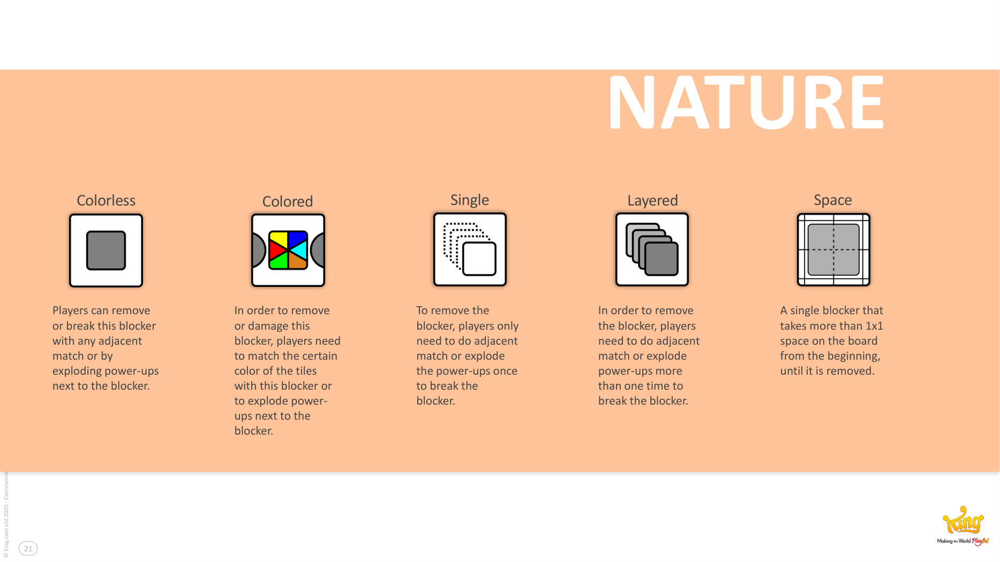
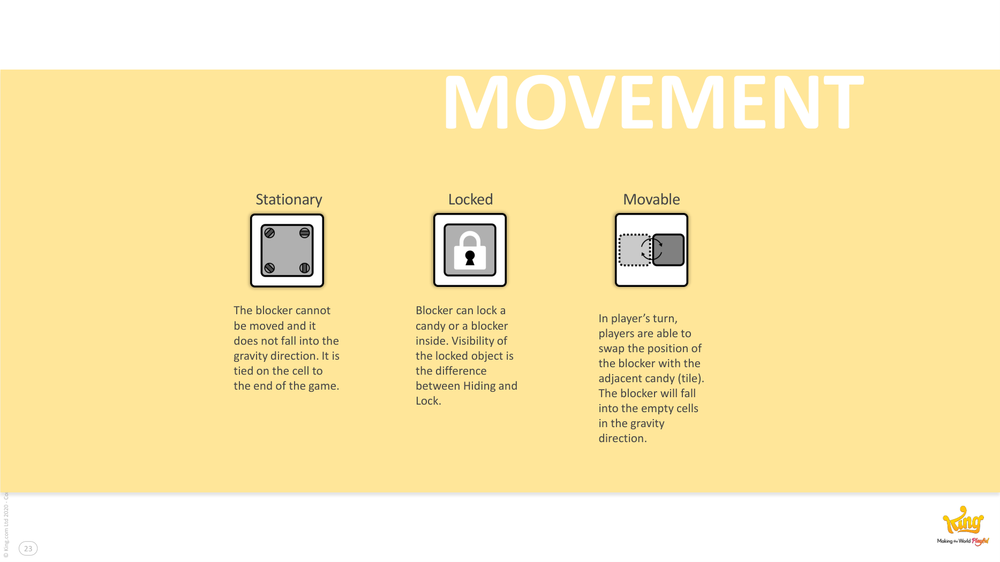
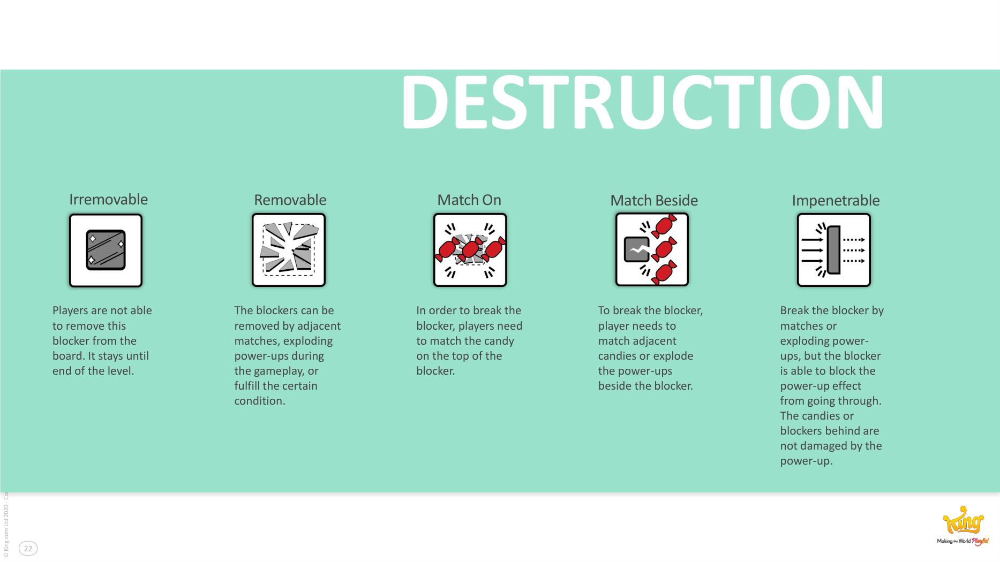
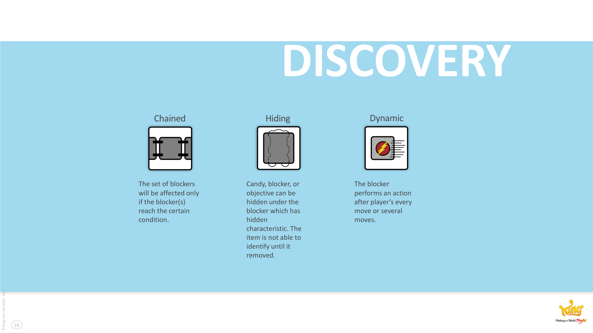
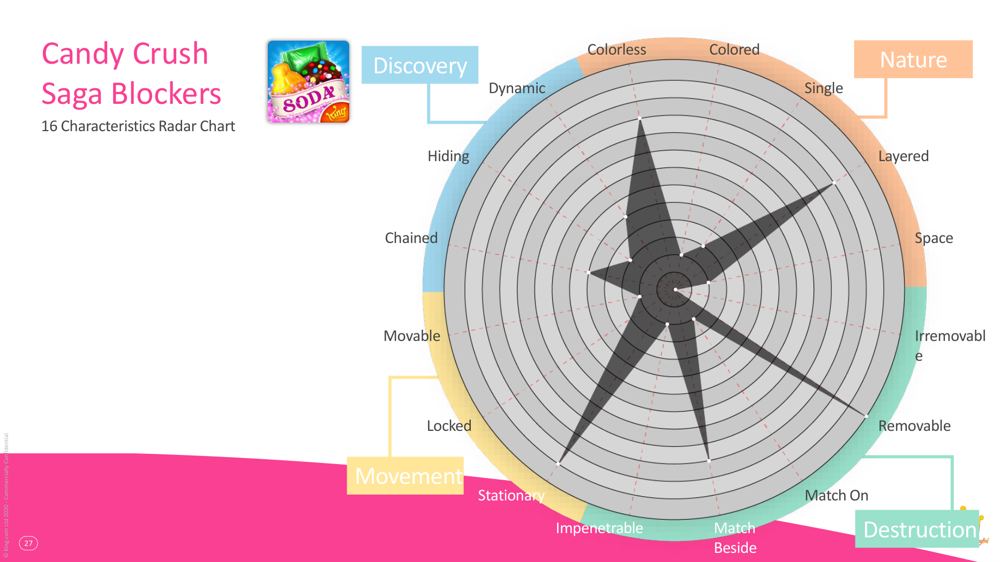

# Blocker Framework

**Summary**: Lucien Chen's 16-characteristic vocabulary for classifying [[blockers]] in [[match-3-games]]. The 16 traits group into 4 categories — Nature, Movement, Discovery, Destruction — and let designers, artists, and developers describe blockers with shared, modular terms.

**Sources**: `GDC2020 Blockers - Lucien Chen.md`.

**Last updated**: 2026-04-25.

---

## The 16 characteristics by category

### Nature (5)

- **Colorless** — broken by *any* adjacent match.
- **Colored** — only matched by tiles of a specific colour.
- **Layered** — needs more than one hit to remove.
- **Single** — a 1×1 single-cell blocker.
- **Space** — occupies more than 1×1 from the start until removed.

### Movement (3)

- **Stationary** — fixed in place; doesn't fall under gravity.
- **Movable** — players can swap it like a candy; falls under gravity.
- **Locked** — visibly contains another candy/blocker trapped inside (visibility is what distinguishes Locked from Hiding).

### Destruction (5)

- **Removable** — can be removed via adjacent matches, power-ups, or fulfilled conditions.
- **Irremovable** — stays for the whole level.
- **MatchOn** — broken by matching the candy *on top of* it.
- **MatchBeside** — broken by matching adjacent candies (or exploding power-ups beside it).
- **Impenetrable** — blocks power-up effects from passing through to candies/blockers behind it.

### Discovery (3)

- **Chained** — performs an action every move (or every N moves).
- **Hiding** — hides a candy/blocker/objective beneath itself; identity revealed only on removal.
- **Dynamic** — affected only when other blocker(s) reach a certain condition.

(Source: GDC2020 Blockers - Lucien Chen.md, pp. 19–24.)

## Radar chart usage

Each blocker is plotted on a 16-axis radar chart. Aggregating all blockers in a game produces a "shape" that characterises the game's difficulty profile. Comparing shapes across the [[candy-crush-franchise]] reveals shared design pressure points — see [[blockers]] for the analysis of why five characteristics dominate.

## Why this is more than a taxonomy

- **Production language.** Designers, artists, and developers all use the same 16 words, reducing translation cost.
- **Modular implementation.** Each characteristic maps to a code module, enabling a blocker customisation tool that mixes and matches.
- **Difficulty signal.** Win-rate distribution across the top-20 hardest and easiest levels correlates with characteristic profile (source: GDC2020 Blockers - Lucien Chen.md).
- **Inspiration map.** Empty axes on the radar chart = unexploited design space.

## Caveats from Chen

The framework is not closed: "new characteristics are always welcome." Use it as a starting vocabulary; extend as needed.

## Related pages

- [[blockers]]
- [[four-ways-of-raising-difficulty]]
- [[match-3-games]]
- [[candy-crush-franchise]]
- [[level-difficulty]]
