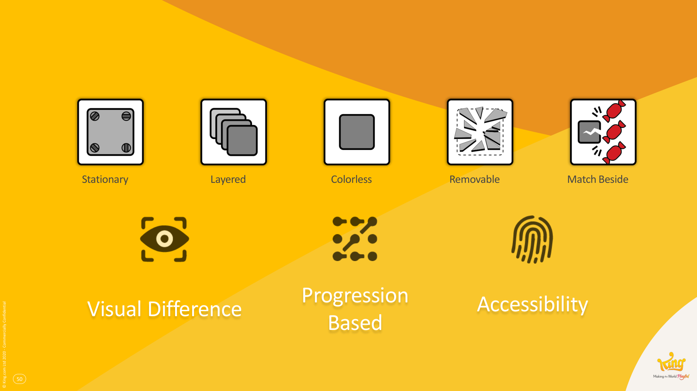
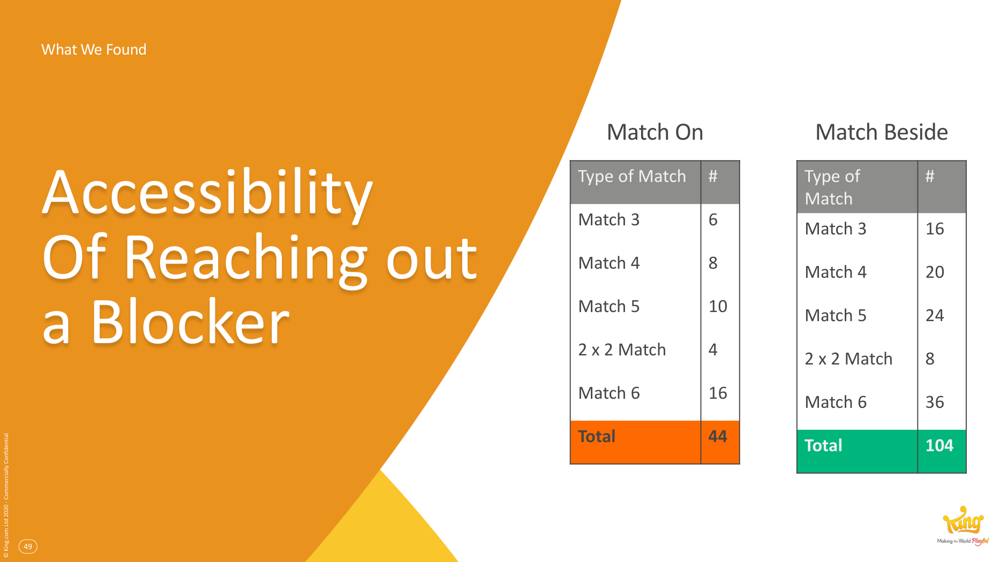

# Blockers

**Summary**: Match-3 obstacles — frosting, jelly, chocolate, liquorice etc — that occupy or constrain board cells. Functionally identical to enemies in core games: they slow progression, force learning, and are the primary lever for tuning level difficulty.

**Sources**: `GDC2020 Blockers - Lucien Chen.md`; `Level Design Saga - Jeremy Kang.md`.

**Last updated**: 2026-04-25.

---

## The blocker = enemy analogy

Lucien Chen's framing (source: GDC2020 Blockers - Lucien Chen.md): in core RPGs, enemies are defined by stats (HP, attack, status effects). In [[match-3-games]], blockers do the same job — provide gameplay variety, slow the player, stop them from winning, increase difficulty. So blockers should have stats too. That's the thesis behind the [[blocker-framework]].

## What blockers do

- **Provide varied gameplay experiences** — each blocker creates a different puzzle.
- **Slow player progression** — they take moves to remove.
- **Stop players from winning** — sometimes terminally (irremovable blockers protecting an objective).
- **Increase difficulty** — different blockers compose into harder levels.

## How they're classified

See [[blocker-framework]] for the 16-characteristic system (4 categories: Nature, Movement, Discovery, Destruction).

## Examples in the [[candy-crush-franchise]]

Frosting, jelly cake, liquorice locks, cupcakes, honey, liquorice swirl, ice blocker, chainblocker, white chocolate, chocolate, bubble gum, candy cane, pancake.

## Why the most common blockers are the way they are

Five characteristics dominate across the franchise: **Stationary, Layered, Colorless, Removable, MatchBeside**.

Three forces explain why (source: GDC2020 Blockers - Lucien Chen.md):

1. **Visual difference** — Stationary, Colorless, and Layered blockers are all easy to *see*. The player can distinguish blocker from candy at a glance.
2. **Progression-based feedback** — Layered and Removable blockers reward action with visible progress. Each successful match peels a layer or removes a tile.
3. **Accessibility** — MatchBeside blockers can be broken in 104 different match patterns; MatchOn only 44. More ways to remove → more accessible to casual players.

These aren't accidents — they're the gravitational centre that any casual-friendly match-3 design will drift toward.

## Related pages

- [[blocker-framework]]
- [[four-ways-of-raising-difficulty]]
- [[match-3-games]]
- [[level-difficulty]]
- [[candy-crush-franchise]]
