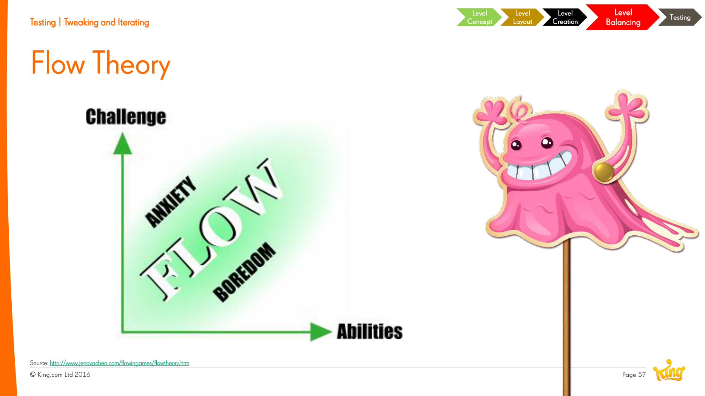

# Flow Theory

**Summary**: Mihály Csíkszentmihályi's model of optimal engagement: a "flow channel" between anxiety (challenge too high) and boredom (challenge too low). Used in game design to calibrate difficulty against player skill over time.

**Sources**: `Level Design Saga - Jeremy Kang.md`.

**Last updated**: 2026-04-25.

---

## The model

A 2D plot: skill on one axis, challenge on the other. The diagonal "flow channel" is where engagement is highest. Above it: anxiety. Below it: boredom. As skill grows, challenge must grow too — otherwise players fall out of flow.

## How games operationalise it

Jeremy Kang cites Jenova Chen's adaptation (http://www.jenovachen.com/flowingames/flowtheory.htm) which adds:

- **Players have different baseline skill** — flow channels differ between players.
- **Games can offer multiple difficulty bands** in parallel rather than a single curve.
- **Player choice** of challenge (within the design's bounds) keeps more players in flow.

## Where it fits in [[level-design]]

[[level-difficulty]] curves in [[saga-games]] are tuned against this model — the goal of progression-tuning is to keep as many players as possible in the flow channel for as long as possible.

## Don't confuse with [[level-flow]]

[[level-flow]] is "guiding the player to the goal within a level" — completely different concept. They share a name but not a meaning.

## Related pages

- [[level-difficulty]]
- [[level-flow]] (different concept!)
- [[level-design]]
