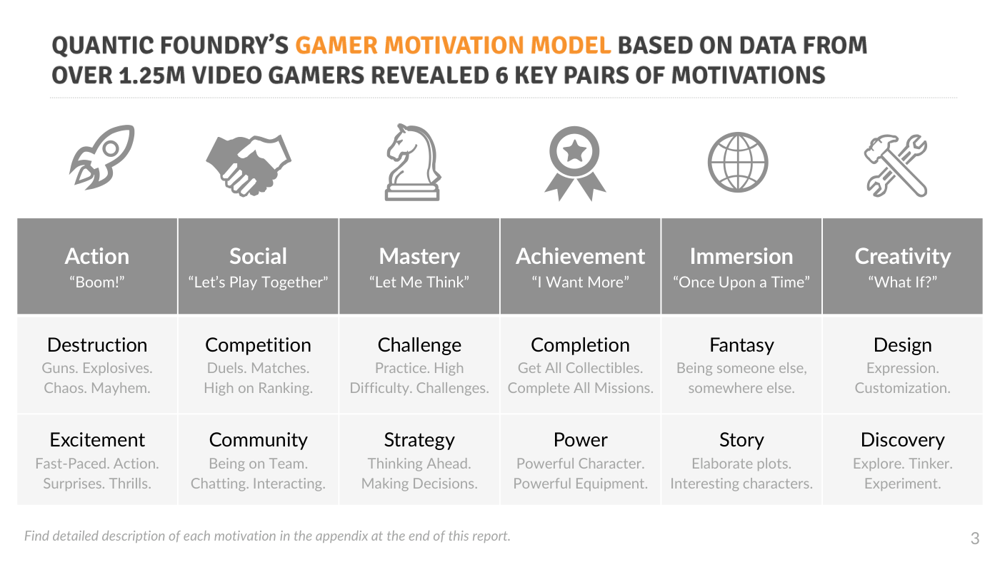
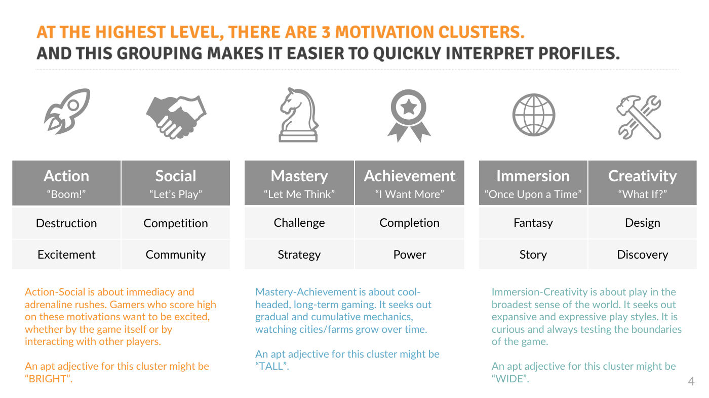
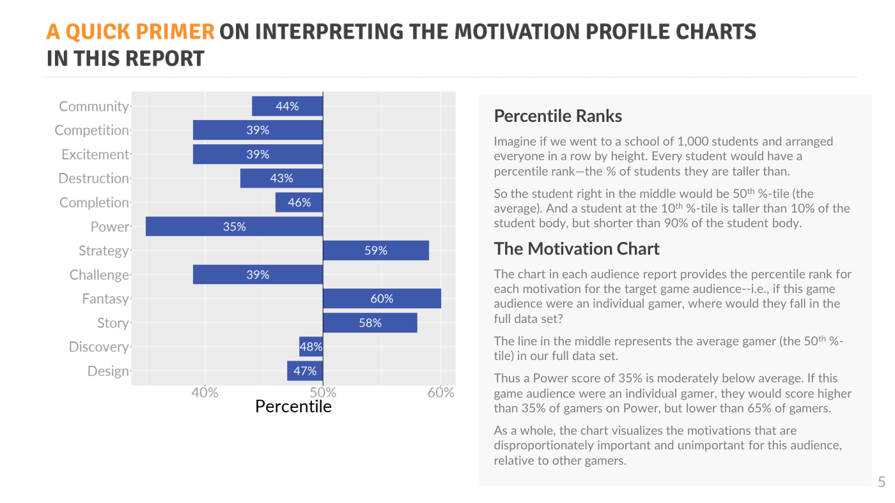
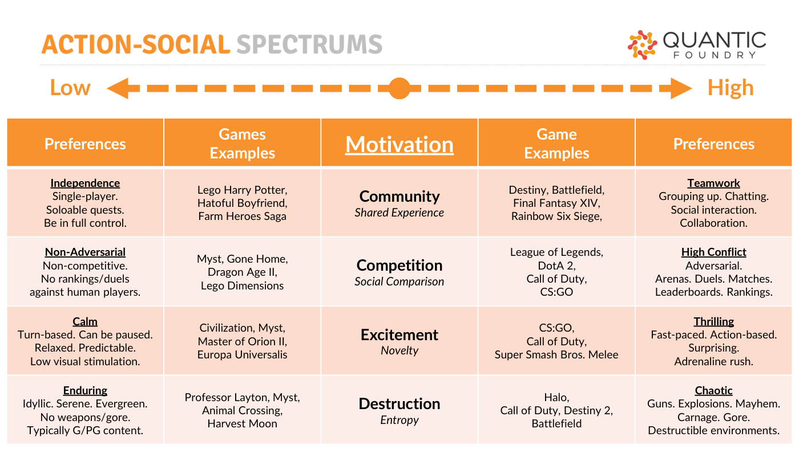
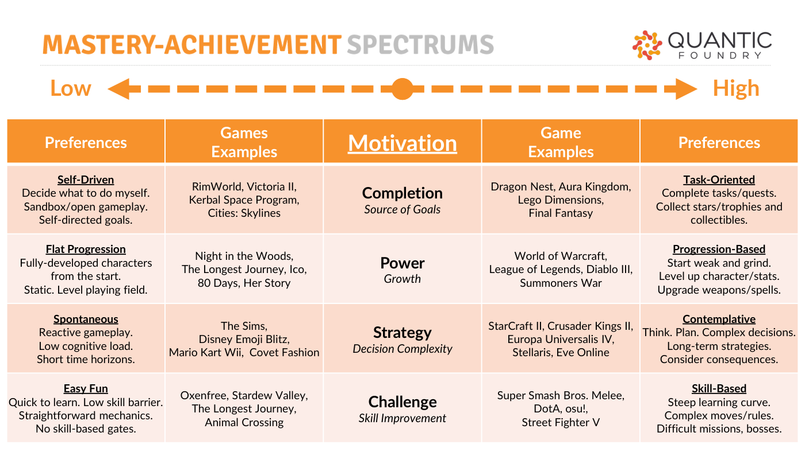
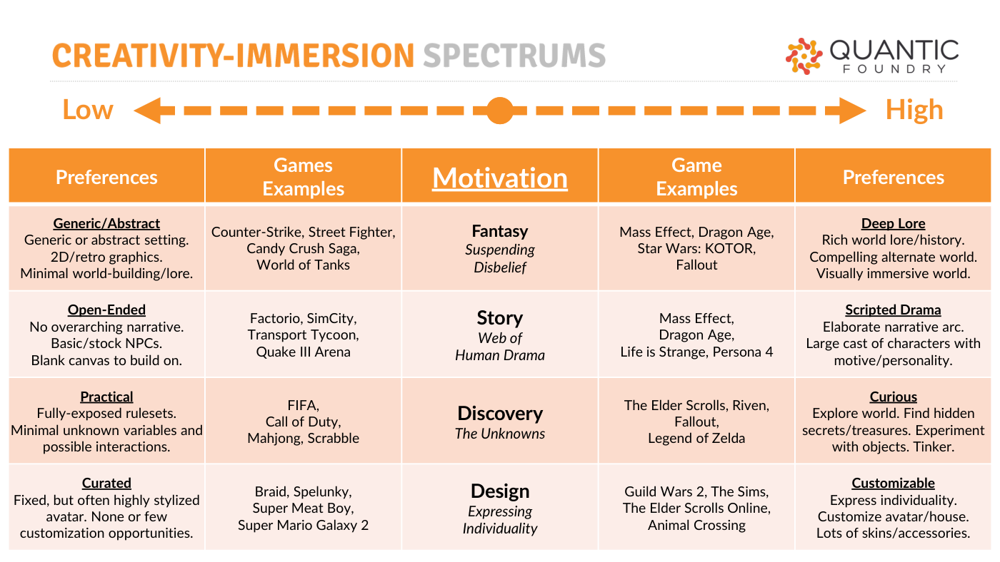

# Gamer Motivation Model — Reference Guide (Quantic Foundry)

**Summary**: Nick Yee and Nic Ducheneaut's empirical model of gamer motivations, built from a 1.25M+ player survey using factor analysis. 12 motivations cluster into 6 pairs and 3 meta-clusters (Bright / Tall / Wide).

**Sources**: `Gamer Motivation Model - Quantic Foundry.md` (extracted from `Gamer-Motivation-Model-Reference.pdf`).

**Last updated**: 2026-04-25.

---

## What's distinctive about this model

Unlike [[bartle-player-types|Bartle's]] introspective typology or the [[mda-framework|MDA]] aesthetic taxonomy, the Quantic Foundry model is *empirical*: motivations were derived via factor analysis on survey responses from over 1.25 million gamers. The clusters are statistical, not theoretical (source: Gamer Motivation Model - Quantic Foundry.md).

## The 12 motivations / 6 clusters

| Cluster | Tagline | Motivations |
|---|---|---|
| **Action** | "Boom!" | Destruction, Excitement |
| **Social** | "Let's Play Together" | Competition, Community |
| **Mastery** | "Let Me Think" | Challenge, Strategy |
| **Achievement** | "I Want More" | Completion, Power |
| **Immersion** | "Once Upon a Time" | Fantasy, Story |
| **Creativity** | "What If?" | Discovery, Design |

Detailed write-ups for [[gamer-motivation-model|each motivation]].

## The three meta-clusters

- **BRIGHT** (Action + Social) — immediacy and adrenaline. *"To be excited."*
- **TALL** (Mastery + Achievement) — long-term, gradual, cumulative play. *"Let things grow."*
- **WIDE** (Immersion + Creativity) — expansive, expressive, curious. *"Test the boundaries."*

These three meta-clusters are the highest-level summary the data supports.

## Percentile ranks

Reports plot the target audience as percentile ranks against the full 1.25M sample. A Power score of 35% means: this audience is more Power-motivated than 35% of all gamers, less than 65%. The 50% line is the average. The visualisation makes it easy to read what's *disproportionately* important to a player segment.

## Each motivation is a spectrum

Critical methodological point: scoring *low* on a motivation is just as informative as scoring high. Players low on Community don't have "less" motivation — they have a strong preference for **Independence** (single-player, soloable quests, full control). Each axis has anchored opposite ends with their own game examples.

## Game examples per motivation (highlights)

- **Destruction** — Call of Duty, Battlefield, Halo.
- **Competition** — League of Legends, DotA 2, CS:GO.
- **Challenge** — Dark Souls, Super Smash Bros. Melee, osu!.
- **Strategy** — Civilization, StarCraft II, Cities: Skylines, Crusader Kings II.
- **Completion** — Final Fantasy, Lego Dimensions.
- **Power** — World of Warcraft, Diablo III.
- **Fantasy** — Mass Effect, Skyrim, Star Wars: KOTOR.
- **Story** — Life is Strange, Persona 4, Mass Effect.
- **Discovery** — Elder Scrolls, Fallout, Legend of Zelda.
- **Design** — Mass Effect (creator), city/space-builders.
- **Excitement** — Super Smash Bros, CS:GO, Call of Duty.
- **Community** — Final Fantasy XIV, Destiny, Rainbow Six Siege.

## Why this matters for design

- **Audience-first design**. If you know which motivations dominate for your target audience, you can prioritise mechanics that serve those motivations.
- **Lacuna detection**. If your design serves zero motivations strongly, you've built a generic game with no anchor.
- **Cross-cluster appeal**. Some games (Mass Effect: Fantasy + Story + Challenge + Design) deliberately span clusters to broaden audience.

## Related pages

- [[gamer-motivation-model]]
- [[player-motivation-models]]
- [[bartle-player-types]]
- [[eight-kinds-of-fun]]
