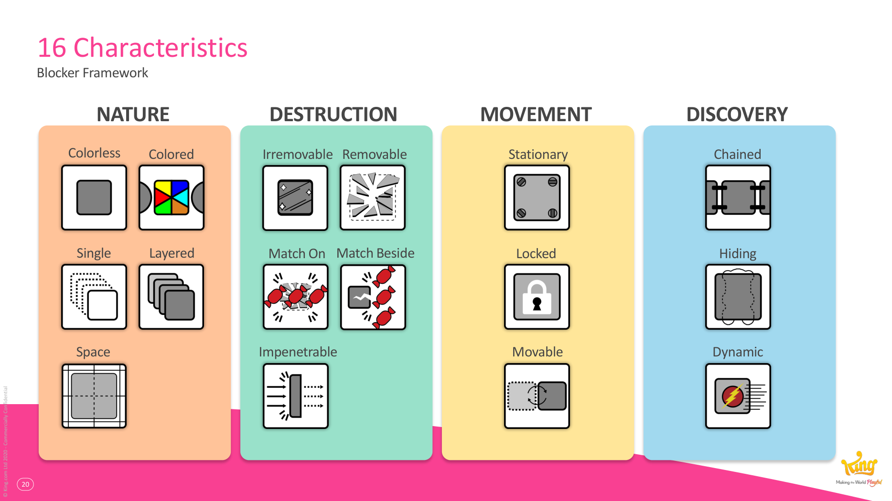
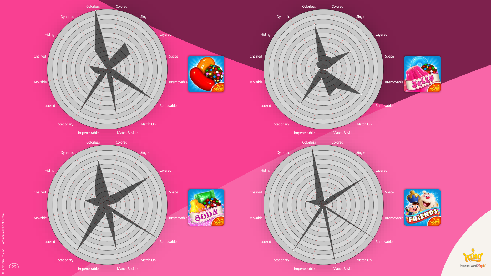
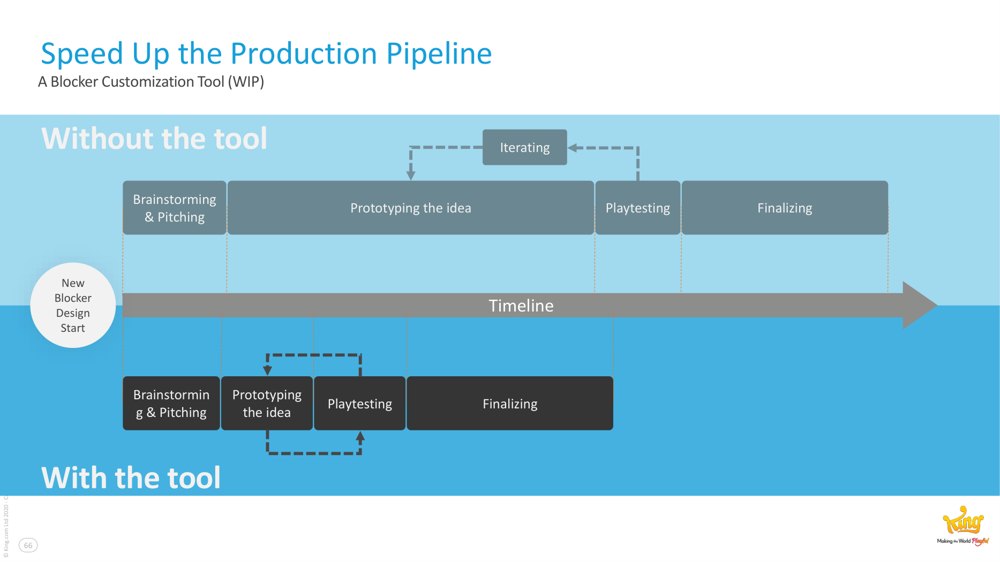

# GDC 2020 – Blockers: Analyzing Difficulty Drivers in Candy Crush Games

**Summary**: Lucien Chen (Senior Level Designer, [[king-games]]) presents a 16-characteristic framework for classifying [[blockers]] in [[match-3-games]], derived from comparing the [[candy-crush-franchise]]'s blocker designs and validated against win-rate data.

**Sources**: `GDC2020 Blockers - Lucien Chen.md` (extracted from `GDC2020 Final PPT.pdf`).

**Last updated**: 2026-04-25.

---

## The argument

Hard-core games (RPG, ARPG) have stat blocks that classify enemies. Match-3 games don't — but their blockers play the same role as enemies (slow progression, increase difficulty, force the player to learn). The talk imports the "stat block" idea: define a vocabulary of blocker traits, then use it to compare designs and predict difficulty.

## The framework's pieces

1. **[[four-ways-of-raising-difficulty]]** — blockers are one of four levers. The others are spawn rate, [[match-3-design-styles|design styles]], and level layout.
2. **[[blocker-framework]]** — 16 characteristics across 4 categories (Nature, Movement, Discovery, Destruction).

    

3. **Cross-game comparison** — radar charts of Candy Crush Saga, Soda, Jelly, and Friends show shared common traits (Stationary, Layered, Colorless, Removable, MatchBeside) and divergences (CCS uses Dynamic / Single / Movable more; Jelly leans MatchOn instead of MatchBeside).

    
4. **Why the common traits are common** — three forces: *visual difference* (player can see what's a blocker), *progression-based feedback* (removing layers gives feedback), *accessibility* (MatchBeside has 104 ways to break vs. MatchOn's 44).
5. **Difficulty correlation** — characteristics correlate with win rate; the framework can predict which blockers will be hard.

## Production benefits Chen emphasised

- **Common language** across designers, artists, and developers.
- **Modularization** — characteristics map onto code modules, enabling a blocker customisation tool that compresses the iteration loop.
- **Faster iteration** — "fail faster, learn faster".

## Key takeaways

- Blockers = enemies. Treat them with the rigour an RPG team treats enemy stats (source: GDC2020 Blockers - Lucien Chen.md).
- 16 characteristics (4 categories × ~4 traits) is the working vocabulary; new traits are welcome.
- The traits aren't equally common because three forces — visual difference, progression-based feedback, accessibility — push toward the central five.

## Related pages

- [[blockers]]
- [[blocker-framework]]
- [[four-ways-of-raising-difficulty]]
- [[match-3-design-styles]]
- [[king-games]]
- [[candy-crush-franchise]]
- [[match-3-games]]
