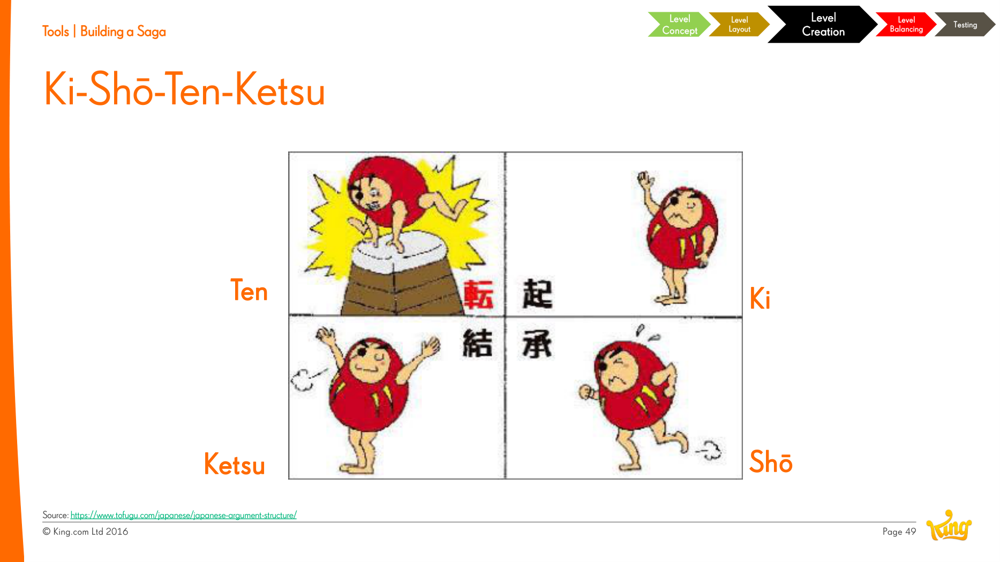

# Ki-Shō-Ten-Ketsu

**Summary**: A four-part Japanese narrative structure (introduction → development → twist → conclusion) used by Jeremy Kang as a tool for pacing sequences of levels in a [[saga-games|Saga]].

**Sources**: `Level Design Saga - Jeremy Kang.md`.

**Last updated**: 2026-04-25.

---

## The four parts

| Part | Function |
|---|---|
| **Ki** | Introduction — establish the situation. |
| **Shō** | Development — expand on the introduction. |
| **Ten** | Twist — introduce something unexpected. |
| **Ketsu** | Conclusion — resolve. |

Unlike Western three-act structure (which depends on conflict), Ki-Shō-Ten-Ketsu doesn't require conflict — the *twist* drives meaning, not opposition. Kang cites this as why it suits level pacing where every level having "conflict" would be exhausting.

## Applied to levels

A 4-level cluster can be designed as:

- **Ki** — introduce a new mechanic or hook.
- **Shō** — develop it; let the player practice.
- **Ten** — twist: combine the new mechanic with something old, or invert expectations.
- **Ketsu** — resolution level that combines everything cleanly.

This pattern can also be applied at larger scales (a whole world, a hundred-level chunk).

## Why it works for [[saga-games]]

Saga games run too long for traditional act-structure pacing. Smaller, repeating, low-intensity arcs (Ki-Shō-Ten-Ketsu) are easier to author at volume and produce a satisfying micro-rhythm without exhausting the player.

(Source: Level Design Saga - Jeremy Kang.md.)

## Related pages

- [[level-rhythm]]
- [[level-design]]
- [[saga-games]]
