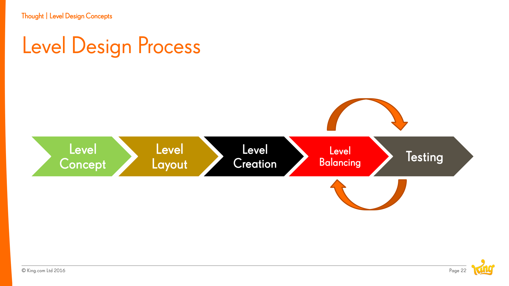
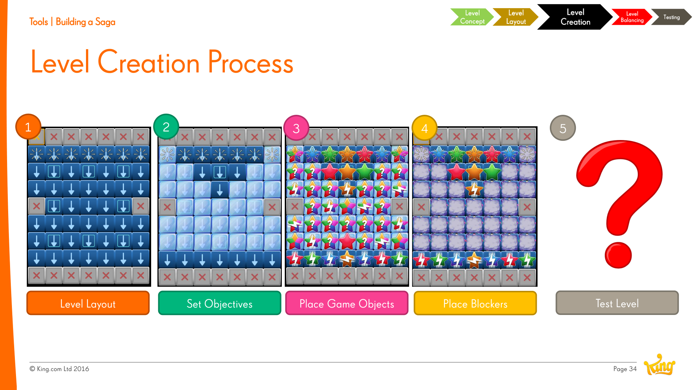

# Level Design Process

**Summary**: The five-stage pipeline Jeremy Kang describes for building [[saga-games|Saga]] levels: Concept → Layout → Creation → Balancing → Testing. Each stage is iterative; the boundaries are blurry but useful for tooling.

**Sources**: `Level Design Saga - Jeremy Kang.md`.

**Last updated**: 2026-04-25.

---

## The five stages

1. **Level Concept** — what's the *idea* of this level? What [[level-hooks|hook]] makes it different from neighbours? Identify the building blocks: which mechanics, modes, blockers, gameplay elements, and modifiers will be used.
2. **Level Layout** — paper-design the board shape, exits, regions. Sketch the player's path through it.
3. **Level Creation** — micro-process inside this stage:
    1. Lay out tiles.
    2. Set objectives.
    3. Place game objects.
    4. Place [[blockers]].
    5. Test.

    
4. **Level Balancing** — tune knobs:
    - Number of objectives.
    - Available moves.
    - Mastery star values.
    - Number of colours on the board.
    - Number and severity of blockers.
5. **Level Testing** — see [[level-testing]] for the four-stage testing protocol (self → internal → qualitative → playtest releases).

(Source: Level Design Saga - Jeremy Kang.md.)

## Why explicit stages matter at scale

When a team produces levels every week for years, an implicit process drifts; level quality becomes inconsistent across designers. Naming and instrumenting each stage lets the team build shared tooling (e.g., [[blocker-framework]] for stage 3.4) and shared review criteria.

## Related pages

- [[level-design]]
- [[level-design-saga-jeremy-kang]]
- [[level-testing]]
- [[blockers]]
- [[blocker-framework]]
- [[saga-games]]
