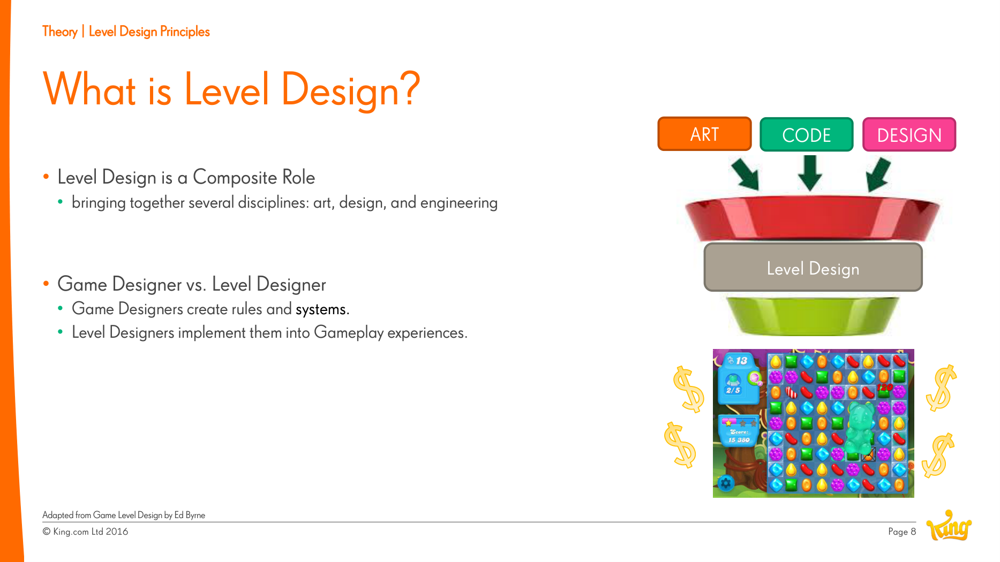
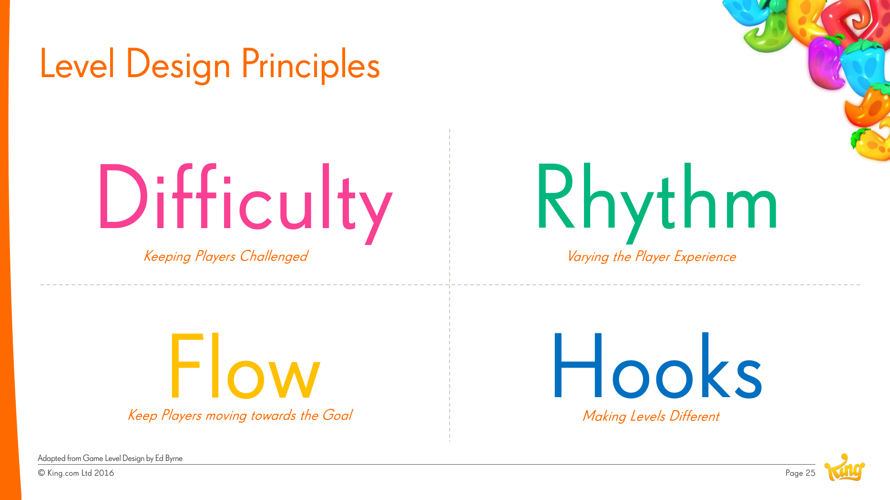

# Level Design

**Summary**: The discipline of turning a game's mechanics into the play experiences the player actually has. Distinct from game design (which defines rules and systems) and from art/code (which provide assets and behaviour), but composed of all three.

**Sources**: `Level Design Saga - Jeremy Kang.md`.

**Last updated**: 2026-04-25.

---

## The composite role

Per Jeremy Kang (source: Level Design Saga - Jeremy Kang.md): "Level design is a composite role bringing together several disciplines: art, design, and engineering."

- **Game designers** create rules and systems.
- **Level designers** implement them into gameplay experiences.

A level designer is the practitioner who sits at the intersection. In smaller teams, one person does both jobs; the distinction is conceptual, not always organisational.

## Where levels sit in the [[mda-framework]]

Mechanics → **Dynamics** → Aesthetics. Level design is the bridge from mechanics to dynamics: given a mechanic (e.g., swap candies), the level is the arena where it produces a *particular* dynamic (e.g., a tense race against limited moves to pop the last bottle).

## The four principles

Level design at [[king-games]] is structured around four reusable principles (adapted from Ed Byrne's *Game Level Design*):

- [[level-hooks]] — make levels feel different.
- [[level-difficulty]] — keep the player challenged.
- [[level-flow]] — guide the player toward the goal.
- [[level-rhythm]] — vary the player's emotional experience.

## The pipeline

See [[level-design-process]] for the five-stage pipeline (Concept → Layout → Creation → Balancing → Testing).

## Specific to casual / [[saga-games]]

- **Volume changes everything.** When a game ships 1000+ levels at 1–2 per week, individual-level craftsmanship has to be supported by tooling and shared frameworks (e.g., [[blocker-framework]], beat charts).
- **Bite-sized brilliance.** Each level needs to deliver its own small arc within minutes — see [[ki-sho-ten-ketsu]] for the pacing pattern Kang invokes.

## Related pages

- [[level-design-process]]
- [[level-hooks]], [[level-difficulty]], [[level-flow]], [[level-rhythm]]
- [[mda-framework]]
- [[saga-games]]
- [[level-design-saga-jeremy-kang]]
