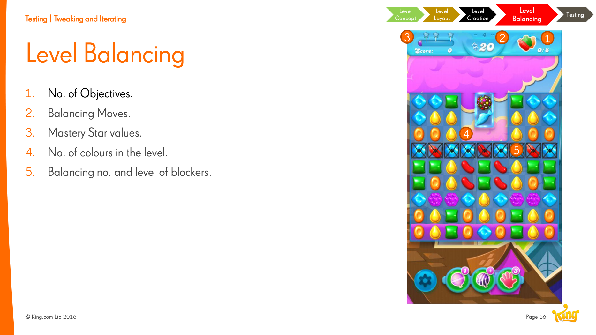

# Level Difficulty

**Summary**: The principle of keeping the player challenged. In a 1000-level Saga, every level is a point on a difficulty curve — and that curve is itself a designed object, not an emergent one.

**Sources**: `Level Design Saga - Jeremy Kang.md`; `GDC2020 Blockers - Lucien Chen.md`.

**Last updated**: 2026-04-25.

---

## What "difficulty" means as a level-design tool

Difficulty subsumes the other principles: it interacts with [[level-rhythm|rhythm]] and [[level-flow|flow]] and is shaped by [[level-hooks|hooks]]. Every game has a difficulty curve; every level sits at a point on it (source: Level Design Saga - Jeremy Kang.md).

## How match-3 levels manipulate difficulty

The four levers — see [[four-ways-of-raising-difficulty]]:

1. [[blockers|Blockers]] (count, type, composition via [[blocker-framework]]).
2. Spawn rate (colours, special candies, objective spawning).
3. [[match-3-design-styles|Design styles]].
4. Level layout.

## How King measures difficulty

- **Cumulative attempts** — how many tries it takes the average player to clear the level. The headline metric (source: Level Design Saga - Jeremy Kang.md).
- **Win rate** — inverse signal; correlates with [[blocker-framework]] characteristics (source: GDC2020 Blockers - Lucien Chen.md).
- **Player progression curve** — fall-off points indicate over-tuned difficulty.

## The five balancing knobs

When a level's difficulty is off, these are the dials you turn first.

## Connection to [[flow-theory]]

Csíkszentmihályi's flow channel — between anxiety (too hard) and boredom (too easy) — is the canonical reference Kang uses. Saga difficulty curves are tuned to keep most players in that channel for as long as possible.

## Case study: Candy Crush Level 65

Kang quotes player reactions before and after a re-balance: "this level just sucks" → "now it is one of the fun levels." A reminder that difficulty is iterative; numbers can be tuned post-launch (source: Level Design Saga - Jeremy Kang.md).

## Related pages

- [[level-design]]
- [[four-ways-of-raising-difficulty]]
- [[blocker-framework]]
- [[flow-theory]]
- [[level-testing]]
