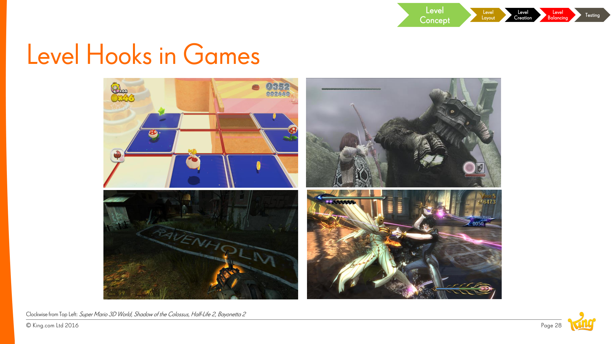

# Level Hooks

**Summary**: Unique elements that make a single level feel different from the others around it. The hook is what a player would describe when telling a friend about a memorable level.

**Sources**: `Level Design Saga - Jeremy Kang.md`.

**Last updated**: 2026-04-25.

---

## What counts as a hook

Per Jeremy Kang (source: Level Design Saga - Jeremy Kang.md):

- A new **special power**.
- A **different gameplay style** than the surrounding levels.
- An **environmental twist** (different gravity, scrolling board, etc.).

A *good* hook can be a "twist" that affects everything else in the level — not just adding one element but reframing the whole experience.

## Examples Kang shows from core games

- *Super Mario 3D World*, *Shadow of the Colossus*, *Half-Life 2*, *Bayonetta 2* — each has standout levels defined by a single dominant hook.

## Why hooks matter in [[saga-games]]

In a 1000-level Saga, a hook every N levels is what prevents the experience from collapsing into "just more candy crushing." Hooks are the meta-level [[level-rhythm|rhythm]] beats: they break up the cadence and give players something to anticipate.

## Related pages

- [[level-design]]
- [[level-rhythm]]
- [[level-design-process]]
- [[saga-games]]
