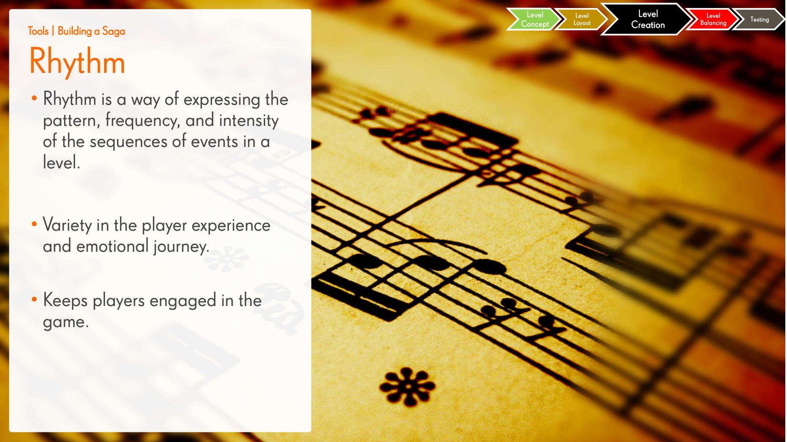

# Level Rhythm

**Summary**: The pattern, frequency, and intensity of events across a sequence of levels. Variety is the goal — it keeps players from settling into a mode and burning out.

**Sources**: `Level Design Saga - Jeremy Kang.md`.

**Last updated**: 2026-04-25.

---

## What rhythm means at the level-sequence scale

Rhythm is *between* levels, not just within them. It answers: "after this level, what will the player want next?" (Source: Level Design Saga - Jeremy Kang.md.)

Factors Kang lists:

- Different game modes alternating.
- Hard levels vs. easy levels — alternation matters.
- Short levels vs. long levels.
- Pace of introducing new content (mechanics, blockers, modifiers).

## Production tools

- **Beat charts** — explicit pacing across a chunk of levels (intensity over time).
- **Level libraries** — catalogues of existing levels indexed by hook/mode/difficulty so designers can rebalance the mix.
- **[[ki-sho-ten-ketsu]]** — 4-part structure (introduction → development → twist → conclusion) applied at the level-cluster scale.

## Why rhythm matters more in [[saga-games]] than in core games

Core games last 10–40 hours. Saga games last *years*. Without explicit rhythm management, the experience flattens; players quit not because of difficulty but because of monotony.

## Related pages

- [[level-design]]
- [[ki-sho-ten-ketsu]]
- [[level-hooks]]
- [[match-3-design-styles]]
- [[saga-games]]
