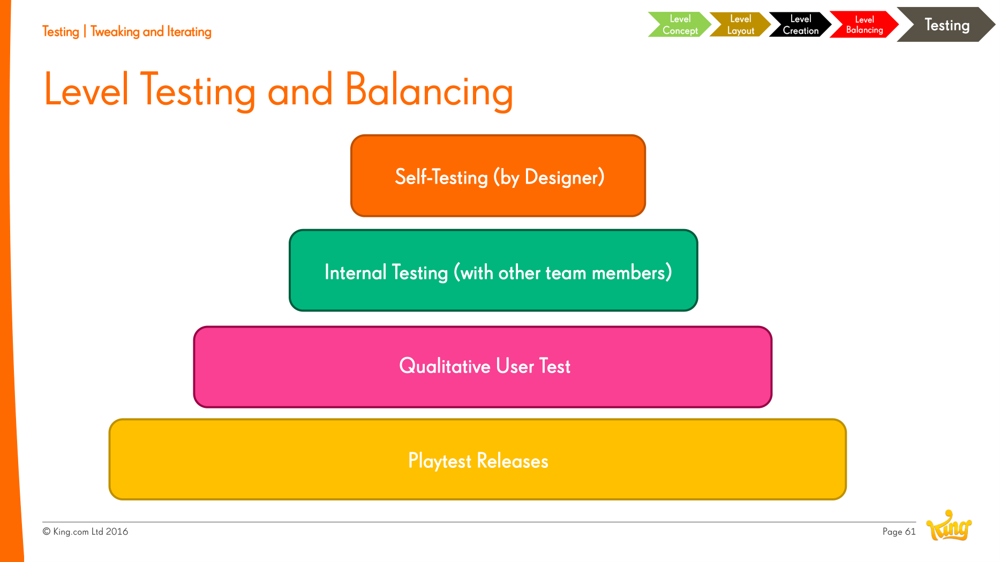
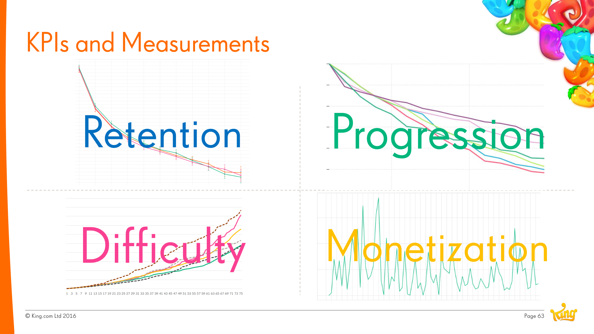

# Level Testing

**Summary**: King's four-stage testing protocol for casual levels — self → internal → qualitative → playtest releases — paired with KPIs that quantify difficulty, retention, progression, and monetisation.

**Sources**: `Level Design Saga - Jeremy Kang.md`.

**Last updated**: 2026-04-25.

---

## The four testing stages

1. **Self-testing (by designer)** — every level the designer plays through themselves first. Catches obvious failures fastest.
2. **Internal testing (with other team members)** — fresh eyes spot what the author's blind to.
3. **Qualitative user test** — non-team players, observed. Surfaces what the player *thinks* is happening, which often isn't what's actually happening.
4. **Playtest releases** — soft-launched updates that gather KPIs at scale.

(Source: Level Design Saga - Jeremy Kang.md.)

## KPIs King watches

- **Difficulty** — cumulative attempts to clear; correlates with [[blocker-framework]] characteristics.
- **Retention** — see [[d1-retention]] for the canonical metric; longer-term retention curves matter more for [[saga-games]].
- **Progression** — what level players reach and where they fall off.
- **Monetisation** — boost purchases, life refills, etc.

## "Where the magician meets the mathematician"

Kang's framing for the balancing discipline: design intuition (magician) needs to be sanity-checked against play data (mathematician). Either alone is dangerous — the magician makes "fun" levels that don't survive contact with players; the mathematician makes "balanced" levels that aren't fun.

## Related pages

- [[level-design]]
- [[level-design-process]]
- [[level-difficulty]]
- [[d1-retention]]
- [[blocker-framework]]
