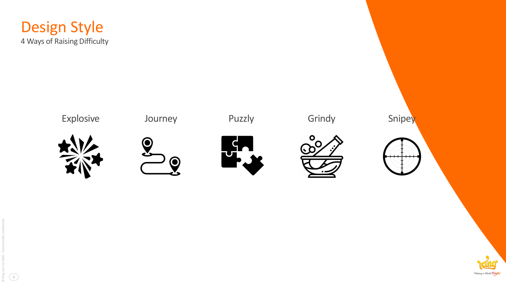
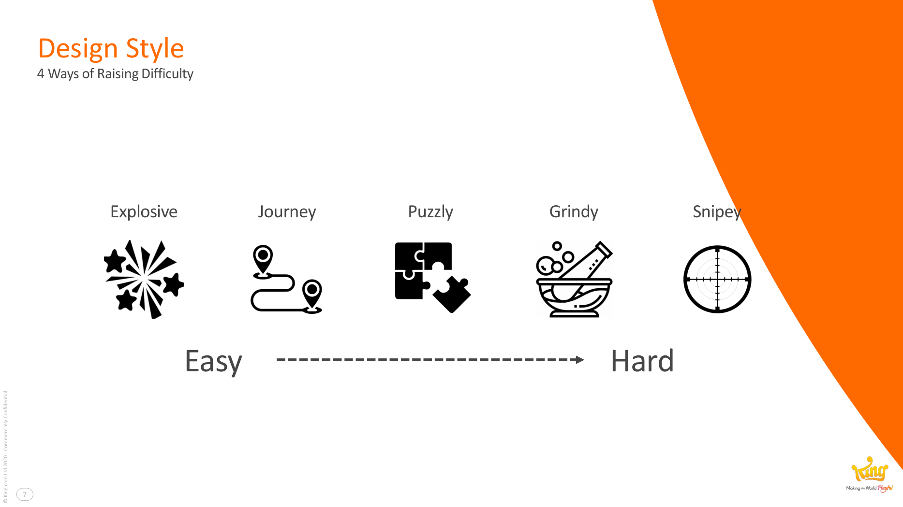

# Match-3 Design Styles

**Summary**: Five archetypes Lucien Chen identifies for how a [[match-3-games|match-3]] level *feels* to play. Each style has a different ideal difficulty band and shapes which [[blockers]] and objectives belong in the level.

**Sources**: `GDC2020 Blockers - Lucien Chen.md`.

**Last updated**: 2026-04-25.

---

## The five styles

| Style | Feel |
|---|---|
| **Explosive** | Chain reactions and big power-up combos; visually rewarding; tends easier. |
| **Snipey** | Precise, surgical matches at specific positions. |
| **Journey** | Move objectives down (or across) the board to a target zone. |
| **Puzzly** | Tight, deliberate, low-margin puzzles. |
| **Grindy** | Long levels that wear the player down by attrition; tends harder. |

(Source: GDC2020 Blockers - Lucien Chen.md, pp. 6–7.)

## How styles compose with difficulty

Chen positions the five styles on an Easy↔Hard axis. **Explosive** and **Journey** skew easier; **Puzzly** and **Grindy** skew harder; **Snipey** lives in the middle. A level's *style* is one of the [[four-ways-of-raising-difficulty]], independent of how many blockers it contains.

## Why the vocabulary matters

It's a [[level-rhythm|rhythm]] tool. When planning a sequence of levels, alternate styles to keep the player from settling into one mode. A 50-level run that's all-Puzzly burns players out even if individual levels are well-tuned.

## Related pages

- [[four-ways-of-raising-difficulty]]
- [[level-rhythm]]
- [[match-3-games]]
- [[blockers]]
