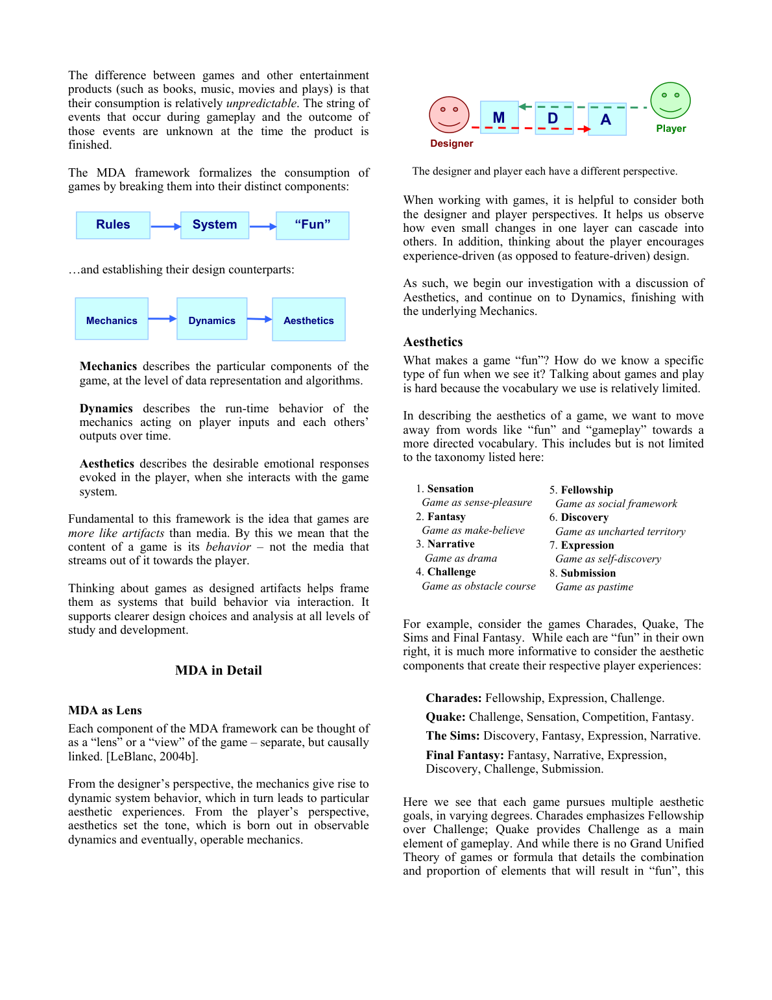

# MDA: A Formal Approach to Game Design and Game Research

**Summary**: The canonical MDA paper by Hunicke, LeBlanc, and Zubek (2004) — the original definition of the [[mda-framework]] and the [[eight-kinds-of-fun]] aesthetic taxonomy. Developed and taught at the GDC Game Design and Tuning Workshops, 2001–2004.

**Sources**: `MDA Framework - Hunicke LeBlanc Zubek.md` (extracted from `MDA Framework.pdf`).

**Last updated**: 2026-04-25.

---

## What the paper does

It proposes a shared vocabulary and reasoning frame for game design that bridges:

- **Game design and development** (the makers).
- **Game criticism** (the analysts).
- **Game research** (the academics).

The key claim: games are *artifacts* (not media), and what matters is their behaviour. Behaviour emerges through iterative interaction between the player and the system, so a designer must reason about three layers at once.

## The three layers

| Layer | What it is | Authored by |
|---|---|---|
| **Mechanics** | Particular components at the level of data representation and algorithms. | Designer directly. |
| **Dynamics** | Run-time behaviour of mechanics acting on player inputs and each other's outputs over time. | Emerges from play. |
| **Aesthetics** | Desirable emotional responses evoked in the player. | Felt by the player. |

The crucial asymmetry: **designers see M→D→A, players see A→D→M.** A designer adjusts mechanics hoping for downstream aesthetics; a player feels the aesthetics first and only later notices the mechanics, if at all.

## The eight kinds of fun

The paper introduces a taxonomy of aesthetic experience to replace vague words like "fun" — see [[eight-kinds-of-fun]]. The eight: Sensation, Fantasy, Narrative, Challenge, Fellowship, Discovery, Expression, Submission.

The paper is explicit that this list is "not meant to be exhaustive or terminal" — but it gives us a vocabulary for what we're trying to make players feel.

## Why iterative design works in this frame

Each layer can be tuned independently:

- **Aesthetic-driven design** — start from the experience you want, work backwards through dynamics to mechanics that produce it.
- **Dynamic adjustments** — Monopoly example: dynamics like "rich-get-richer" can be tuned with new mechanics (taxes on the wealthy, subsidies for poor players, depleting resources to add time pressure).
- **Mechanics adjustments** — small mechanic changes propagate up to dynamics and aesthetics, often in surprising ways.

## Examples the paper uses

| Game | Aesthetics | Why |
|---|---|---|
| **Charades** | Fellowship, Expression, Challenge | Cooperative team play with creative communication under pressure. |
| **Quake** | Challenge, Sensation, Competition, Fantasy | Twitch combat with sensory pyrotechnics in a fantasy setting. |
| **The Sims** | Discovery, Fantasy, Expression, Narrative | Open simulation where players invent their own stories. |
| **Final Fantasy** | Fantasy, Narrative, Expression, Discovery, Challenge, Submission | Long-form RPG mixing many aesthetics. |

## Why the paper still matters

Two decades later, MDA is the most-cited frame for separating the layers of game design. The 8-aesthetics vocabulary remains a working language across studios, including [[king-games]] (see [[level-design-saga-jeremy-kang]] where Kang invokes it directly).

## Related pages

- [[mda-framework]]
- [[eight-kinds-of-fun]]
- [[mda-and-8-kinds-of-fun-jenny-wang]]
- [[player-motivation-models]]
- [[level-design]]
